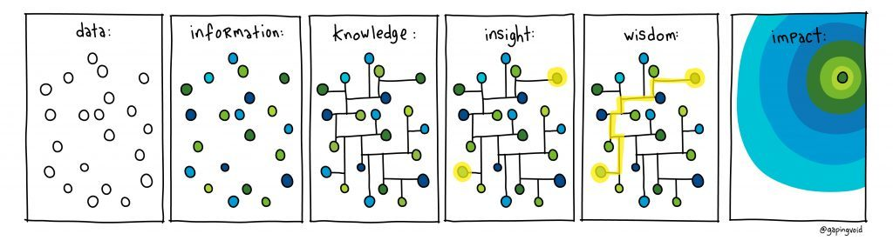

# 缘起

之前看过左耳朵耗子写的关于程序员成长的一篇[blog](https://mp.weixin.qq.com/s?__biz=MjM5MDE0Mjc4MA==&mid=2651010393&idx=1&sn=aa9d058fe0b656c0689d885e5abcdeb6&chksm=bdbecd0a8ac9441c6144c8207758e0158d73d715bb0c081232e6fc18df402c9d2246edb27891&mpshare=1&scene=1&srcid=1110shNA2So3dkJAkP4a1Z2A#rd), 里面在谈到程序员成长的部分, 推荐大家每周完成ARTS:
1. Algorithm: 每周完成一道leetcode
2. Review: 阅读或点评一篇英文技术文章
3. Tips: 学习至少一个技术技巧
4. Share: 输出一篇技术文章

算法,我现在每天都刷leetcode的每日一题,已经坚持了7月有余; 英文技术文章,每周会阅读hacknews和英文技术书籍. 技术技巧,一直也在保持学习新技术. 比较困难地是写blog, 因为之前总把这事情想的太重了,给自己的期望或者负担也比较高,很容易半途而废.

# Review
刚好在这周的Hacknew上,看到一篇[Write more, but shorter](https://blog.kewah.com/2021/write-more-but-shorter/?utm_source=hackernewsletter&utm_medium=email&utm_term=fav)刚好来解决这个问题.

刚好我自己记录一下,一方面是学习,一方面是实践.

blog作者最近刚好也在使用[Zettelkasten 笔记](https://zettelkasten.de/introduction/zh/),卡片盒里会存储大量的知识,需要整理输出.因为作者建议要大量频繁地输出,同时每次输出的内容可以尽量地少.

这个建议刚好解决了我的问题,一方面完成了打卡,同时也不会给自己造成很大的负担.至于为什么更频繁更少地输出比较好呢? 建议你可以看看参考资料1和2.

# 卡片盒笔记法
顺着作者的推荐,我刚好又看到了**卡片盒学习法**,又是比较适合我的情况.

## What
顾名思义,卡片盒笔记法是一种记录笔记的方法,但不同[康奈尔笔记法](http://www.360doc.com/content/19/0612/00/219382_841866855.shtml)这样纯粹的笔记记录方法.卡片盒笔记更多地是在强调知识的网络作用.

当我们希望能够记住一个知识的时候,除了[艾宾浩斯曲线](https://www.zhihu.com/question/19798259)这样的硬办法之外.主动思考,同时和既有知识网络连接是更加有效率的办法.而卡片盒笔记法就是这样的方法.

## how
卡片盒笔记法将记录笔记的过程标准化,分别如下:
1. 简短笔记

随时记录思考,灵感和想法,更多的时候就是一句话或者一段话

2. 文献笔记

阅读文章的时候,摘录和思考的内容. 以初步思考为佳,最好不要仅仅只是摘抄

3. 永久笔记

对笔记做整理, 格式包括: 标题,标签,内容,引用等

4. 创造联接

将笔记嵌入到既有的知识网络中,这里也叫做`有机生长`

5. follow兴趣

跟随兴趣和日常作用,不断地输出*简短笔记*和*文献笔记*

6. 整理笔记

将永久笔记进行整理,形成知识网络.如果有必要可以写*结构笔记*,有点类似于目录.

7. 查遗补缺

在既有知识网络的基础上,查遗补缺,主动补充知识的空缺. 同时寻求输出线性的文章.

## Tips
1. 笔记内容强调原子化
2. 强调联接,同时必须说明原因
3. 精选标签,宜精不宜多.不要使用目录管理笔记
4. 精选的总入口,网状的知识体系. 可以漫游其中

# 总结
看别人评论说,记录卡片式笔记会上瘾,同时一种新的学习方法也需要不断地刻意练习以内化.接下来一段时间,我来践行之.

# 参考资料
1. [Write more, but shorter](https://blog.kewah.com/2021/write-more-but-shorter/?utm_source=hackernewsletter&utm_medium=email&utm_term=fav)
2. [Write 5x more but write 5x less](https://critter.blog/2020/10/02/write-5x-more-but-write-5x-less/)
3. [使用 Zettelkasten 笔记助力学习](https://sspai.com/post/64259)
4. [卢曼卡片盒笔记法介绍](https://zettelkasten.de/introduction/zh/)
